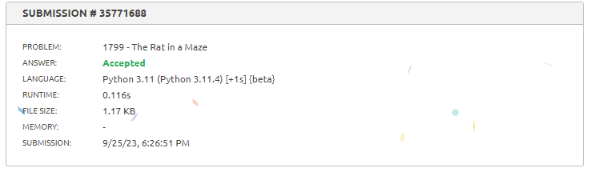

# Exercícios do juiz online vjudge

**Número da Lista**: 1<br>
**Conteúdo da Disciplina**: Grafos 1<br>

## Alunos
|Matrícula | Aluno |
| -- | -- |
| 17/0020291  |  Paulo Henrique Almeida da Silva |
| 19/0023376  |  Abraão Alves Ribeiro |

## Sobre 
Este repositório contém uma coleção de exercícios relacionados a grafos resolvidos e testados em juízes online. O objetivo principal deste projeto é fornecer soluções para problemas de grafos frequentemente encontrados em competições de programação e desafios em linha, além de servir como uma referência para estudantes e entusiastas de algoritmos gráficos.

## Organização 

O projeto está organizado em diretórios individuais, cada uma contendo soluções para um problema específico. Cada solução é cuidadosamente documentada e implementada em C++ e/ou Python, com o código-fonte e uma breve descrição do problema. Além disso, os códigos estão otimizados e testados em juízes online populares para garantir sua precisão e eficiência.


## Screenshots


<p align=center><strong>Status de submissão do Exercício A.</strong></p>


<p align=center><strong>Status de submissão do Exercício B.</strong></p>



<p align=center><strong>Status de submissão do Exercício C.</strong></p>


## Instalação 
**Linguagens**: Python e C++<br>

Para executar o Exercício A, você deve ter o seguinte software instalado em sua máquina:

- Um compilador C++.

Certifique-se de que o compilador C++ esteja corretamente instalado e configurado em seu ambiente antes de prosseguir com a execução do exercício.
## Uso 

### [Exercício A](./ExercicioA_AtCoder/A.pdf) 
Para compilar e executar o Exercio A digite no seu terminal os seguintes comandos:

Para compilar: 
```
$ g++ A.cpp -o app
```

Para executar os casos de teste (substitua X por 1 ou 2): 
```
$ ./app < entradaX.txt > saida.txt
```

Para conferir se a resposta está correta (substitua X por 1 ou 2):
```
$ diff saida.txt saidaX_desejada.txt
```

### [Exercício B](./ExercicioB_AtCoder/B.pdf)
```
python ./ExercicioB_AtCoder/B.py
```

### [Exercício C](./exercicioC_Beecrowd/C.pdf)
```
python ./ExercicioB_AtCoder/B.py
```


